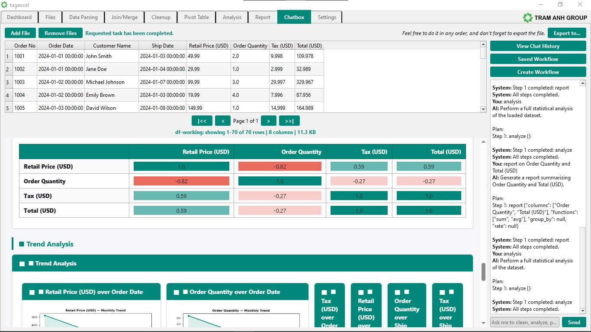

# tagExcel

A desktop data processing application for Windows 10/11. Load, clean, analyze, transform, and visualize spreadsheet data with AI-assisted operations -- all in a native GUI.

[](https://opensource.org/licenses/MIT)
[](https://www.python.org/downloads/)



## Features

- **File Import** -- Load CSV, Excel (.xls, .xlsx) files with automatic encoding detection
- **Data Parsing** -- Clean data: strip whitespace, detect null sentinels, remove duplicates, infer types, normalize Vietnamese diacritics (Unicode NFC), parse dates
- **Join/Merge** -- Left, right, inner, and outer joins between two dataframes with AI-assisted configuration
- **Data Cleanup** -- Delete duplicate rows, null rows, null columns, or specific rows/columns with undo support
- **Pivot Table** -- Interactive pivot table builder with drag-and-drop field zones and AI-suggested configurations
- **Statistical Analysis** -- Per-column statistics (numeric distributions, text analysis, correlations), box plots, histograms, scatter plots, and radar charts
- **Custom Reports** -- Build reports with mathematical, statistical, and financial functions (NPV, IRR, ROI, CAGR, payback period, future value, present value) with group-by support
- **Business Dashboard** -- KPI cards, revenue trend charts, category distributions, and anomaly alerts
- **AI Chatbox** -- Chat interface that executes data operations (parse, join, delete, pivot, analyze, report, dashboard, export) with chat history, saved workflows, and operation plan accept/reject
- **Export** -- Export results to Excel (.xlsx, .xls), CSV, or HTML
- **Dual Language** -- English and Vietnamese (auto-detected from locale)
- **Light & Dark Themes** -- System-native Qt Fusion style

## Requirements

- Windows 10 or 11 (64-bit)
- Python 3.13+ (for running from source)

## Installation

### Option 1: Portable Build (Recommended)

Download the latest zip from [Releases](https://github.com/Vincent-HaiNgo/tagexcel/releases), extract it, and double-click `tagexcel.exe`.

### Option 2: Run from Source

```bash
python -m venv venv
venv\Scripts\activate
pip install -r requirements.txt
python main.py
```

## AI Setup

tagexcel supports any OpenAI-compatible API endpoint, including local LLMs via Ollama.

### Option A: Cloud AI (OpenAI, Groq, etc.)

1. Go to **Settings** > **AI Agent**
2. Fill in:
   - **Provider** -- your provider name (e.g., `OpenAI`, `Groq`)
   - **Model** -- model ID (e.g., `gpt-5`, `llama-3.3-70b`)
   - **API Key** -- your API key from the provider
   - **URL** -- provider's API endpoint (e.g., `https://api.openai.com`)
3. Click **Save**

### Option B: Local AI via Ollama

1. Download and install [Ollama](https://ollama.com)
2. Open Ollama, go to 'Settings', and 'Sign in' (easy is with your Google Account)
3. In Ollama, (go back) to chat, and in the AI Model dropdown list select:
   ```
   gemma4:31b-cloud
   ```
4. In tagexcel, go to **Settings** > **AI Agent**
5. Fill in (API Key is not required):
   - **Provider** -- `Ollama`
   - **Model** -- your pulled model (e.g., `gemma4:31b-cloud`)
   - **API Key** -- leave empty
   - **URL** -- `http://127.0.0.1:11434`
6. Click **Save**
7. The Chatbox tab and all AI-assisted features will now use your local LLM

## Usage

1. Launch tagexcel
2. Use the **Files** tab to load your spreadsheet data
3. Navigate through tabs to clean, join, pivot, analyze, or build reports
4. Use the **Chatbox** tab to describe operations in natural language
5. Configure your AI provider in **Settings** (see AI Setup above)
6. Export results via the Export button on any tab

## Tech Stack

- [Python 3.13](https://www.python.org/)
- [PyQt6](https://www.riverbankcomputing.com/software/pyqt/) -- GUI framework
- [pandas](https://pandas.pydata.org/) -- Data manipulation
- [matplotlib](https://matplotlib.org/) -- Charts and visualizations
- [openpyxl](https://openpyxl.readthedocs.io/) / [python-calamine](https://github.com/dimastbk/python-calamine) -- Excel I/O

## License

MIT -- see [LICENSE](LICENSE) file for details.
